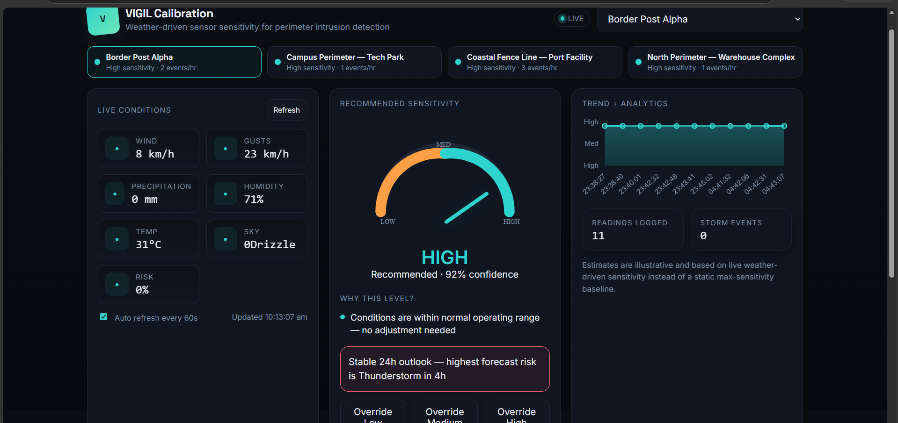
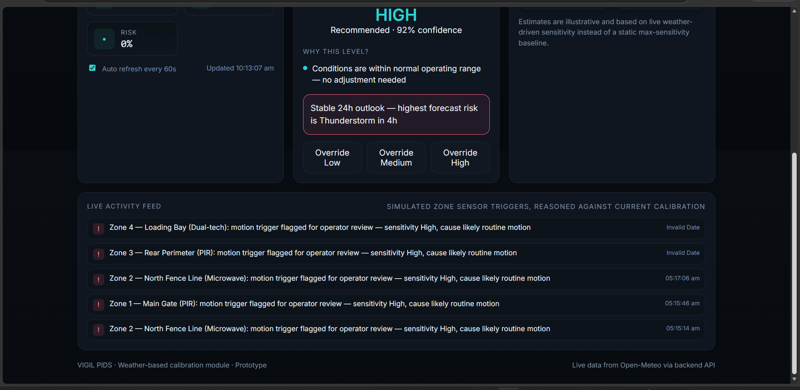
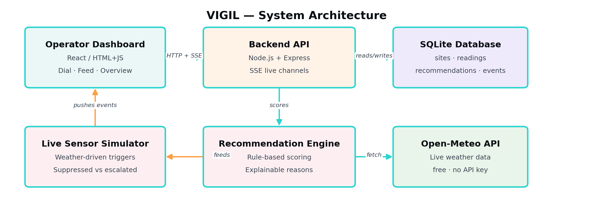

<div align="center">

# 🛡️ VIGIL
### Weather-Based Sensor Calibration Suggestion System

**A live, self-adjusting calibration layer for Perimeter Intrusion Detection Systems (PIDS)**
that reads real weather, reasons about it in plain language, and tells operators — in real time — exactly how sensitive their sensors should be right now.

[](https://nodejs.org)
[](https://expressjs.com)
[](https://www.sqlite.org)
[](https://open-meteo.com)
[](#-real-time-architecture)
[](#-license)

**🎥 [Watch the demo video](#)** &nbsp;·&nbsp; **🚀 [Live walkthrough below](#-see-it-live)** &nbsp;·&nbsp; **📄 [Full case study PDF](./docs)**

</div>

<br>

<p align="center">
  
</p>

<p align="center"><i>Every panel above is populated with <b>real, live data</b> — not mock data. This is a screenshot of the actual running app.</i></p>

<br>

## ⚡ The problem, in one line

Perimeter intrusion sensors (PIR / microwave / dual-tech) false-alarm constantly in bad weather — wind-blown debris, rain sheeting on lenses, storm gusts — and today, operators only ever adjust sensitivity *after* alarm fatigue has already set in.

## ✅ What VIGIL does about it

VIGIL sits between the weather and the sensor. It continuously pulls live conditions for every monitored site, runs them through an **explainable rule engine**, and recommends — or auto-applies — the sensitivity level best suited to *right now*. No black box: every recommendation ships with the exact reasons behind it.

<br>

## 🌟 Why this stands out

| | |
|---|---|
| 🔴 **Actually real-time** | Server-Sent Events push weather updates, sensitivity changes, and live sensor events to every connected dashboard instantly — zero polling, zero manual refresh. |
| 🧠 **Explainable, not a black box** | Every recommendation lists the exact rules that fired — `"Wind speed 46 km/h exceeds 40 km/h threshold"` — so operators trust *why*, not just *what*. |
| 📡 **Live activity feed** | Simulated zone-level sensor triggers, reasoned in real time against the current sensitivity — watch triggers get auto-suppressed or escalated for review as they happen. |
| 🔮 **Predictive, not just reactive** | A 24-hour forecast lookahead warns operators *before* a change is needed: `"Rain expected in 3h — sensitivity will auto-lower to Medium."` |
| 🗺️ **Mission-control overview** | All monitored sites at a glance, live status dots, click to jump between them — feels like an actual ops center, not a single-page demo. |
| 🎛️ **Operator override, always** | Manual override is a first-class, fully auditable action — operators can always take control, and every override is logged with a timestamp and reason. |
| 🌐 **Zero-friction weather data** | Powered by [Open-Meteo](https://open-meteo.com) — free, no API key, no rate-limit headaches during a live demo. |

<br>

## 🎬 See it live

<p align="center">
  
</p>

<p align="center"><i>The activity feed above updates on its own — new events fade in every few seconds as live weather conditions drive the calibration engine.</i></p>

<br>

## 🏗️ Architecture

<p align="center">
  
</p>

```
Browser Dashboard  ⇄  Express API  ⇄  Recommendation Engine  ⇄  SQLite
      ▲                    │
      │ SSE (live push)    ▼
      └──────────  Open-Meteo Weather API
```

Real weather drives the real recommendation engine and the real database. A lightweight simulator layer (clearly labeled in the UI) generates zone-level sensor trigger events at a rate driven by the *actual* current wind/rain/storm conditions — standing in for physical PIR/microwave hardware this prototype doesn't have wired up, while still demonstrating the exact suppressed-vs-escalated decision logic a live deployment would run. See [`docs/LIVE_LAYER.md`](docs/LIVE_LAYER.md) for the full breakdown of what's real vs. simulated.

<br>

## 🧰 Tech stack

| Layer | Choice | Why |
|---|---|---|
| Frontend | HTML/JS + Chart.js (React variant included) | Fast, dependency-light, real-time-friendly |
| Backend | Node.js + Express | Simple, well-understood REST + SSE layer |
| Database | SQLite (`better-sqlite3`) | Zero-config, file-based — clone and run, no setup |
| Weather data | [Open-Meteo API](https://open-meteo.com) | Free, no API key, CORS-enabled |
| Real-time transport | Server-Sent Events | Native browser support, auto-reconnect, no extra client library |
| Scheduling | `node-cron` | Configurable polling, independent of dashboard being open |

<br>

## 🚀 Quick start

```bash
git clone <this-repo-url>
cd vigil-calibration

# 1. Install & initialize
cd backend
npm install
npm run init-db          # creates SQLite DB, seeds 4 sites + 16 perimeter zones

# 2. (Optional) seed some history so charts aren't empty on first load
npm run seed-history

# 3. Run
npm start
```

Then open **http://localhost:4000** — the dashboard is served directly by the backend, no separate frontend build step.

```bash
# sanity check the API directly
curl http://localhost:4000/api/health
curl http://localhost:4000/api/overview
```

Want a livelier demo (faster weather refresh + busier activity feed)? Copy `backend/.env.example` to `backend/.env` and lower `WEATHER_POLL_CRON` / `LIVE_TICK_MS`.

<br>

## 🔌 API reference (summary)

| Endpoint | What it does |
|---|---|
| `GET /api/sites` | List all monitored sites |
| `GET /api/sites/:id/weather` | Fetch live weather, compute + log a recommendation |
| `GET /api/sites/:id/stream` | **SSE** — live weather + sensor event push for one site |
| `GET /api/sites/:id/history` | Recent readings + recommendations for charting |
| `GET /api/sites/:id/events` | Recent live activity feed entries |
| `POST /api/sites/:id/override` | Apply a manual sensitivity override |
| `DELETE /api/sites/:id/override` | Clear an active override |
| `GET /api/overview` / `/api/overview/stream` | Mission-control snapshot / **SSE** live feed, all sites |

Full request/response shapes: [`docs/API_DOCUMENTATION.md`](docs/API_DOCUMENTATION.md)

<br>

## 🧠 How the recommendation engine decides

Sensitivity starts at **High** and steps down as adverse conditions accumulate — every triggered rule is surfaced to the operator in plain language.

| Condition | Threshold | Effect |
|---|---|---|
| Wind speed | ≥ 20 km/h moderate / ≥ 40 km/h severe | −1 / −2 |
| Wind gusts | ≥ 55 km/h | −1 |
| Precipitation | ≥ 2 mm light / ≥ 15 mm heavy | −1 / −2 |
| Thunderstorm | Weather code ≥ 95 | −2, storm flag raised |
| Humidity + rain | ≥ 90% while raining | −1 (lens fogging risk) |
| Temperature | ≤ 2°C | −1 (frost/ice risk) |

Full implementation: [`backend/services/recommendationEngine.js`](backend/services/recommendationEngine.js) — pure, dependency-free, unit-testable in isolation.

<br>

## 📁 Project structure

```
vigil-calibration/
├── frontend/
│   ├── index.html                       # live dashboard (served by the backend)
│   └── vigil_calibration_dashboard.jsx  # standalone React version
├── backend/
│   ├── server.js                        # Express API + SSE channels + live sensor simulator
│   ├── services/recommendationEngine.js # explainable rule engine
│   ├── db/init.js                       # SQLite schema + seed data
│   ├── scripts/generate_sample_data.js  # seed historical readings for demo/charts
│   └── test/run-tests.js
└── docs/
    ├── ARCHITECTURE.md
    ├── DATABASE_SCHEMA.md
    ├── API_DOCUMENTATION.md
    ├── LIVE_LAYER.md                    # what's real vs. simulated, and why
    └── PRESENTATION_OUTLINE.md
```

<br>

## 🗺️ Roadmap

- [ ] Train a model on real historical false-alarm logs once available from a pilot site, cross-validated against the rule engine
- [ ] Direct integration with camera/sensor firmware to apply sensitivity changes automatically
- [ ] Multi-tenant auth, SMS/email alerting, role-based access for security operations centers
- [ ] PDF shift-report export and natural-language "ask the site" operator assistant

<br>

## 🙏 Acknowledgements

Weather data: [Open-Meteo.com](https://open-meteo.com) (free API, CC BY 4.0 attribution) · Charting: Chart.js / Recharts · Icons: Lucide

<br>

## 👥 Team

Built for **A-1 Launchpad 2026 — National Hackathon** (Software Development / AI & ML track)

**[Team Name]** — [Member 1] · [Member 2] · [College / Institution]

<br>

## 📄 License

MIT — see [`LICENSE`](LICENSE)

<div align="center">

---

**VIGIL** · Weather-adaptive calibration for perimeter security · Built live weather-first, not as an afterthought.

</div>
