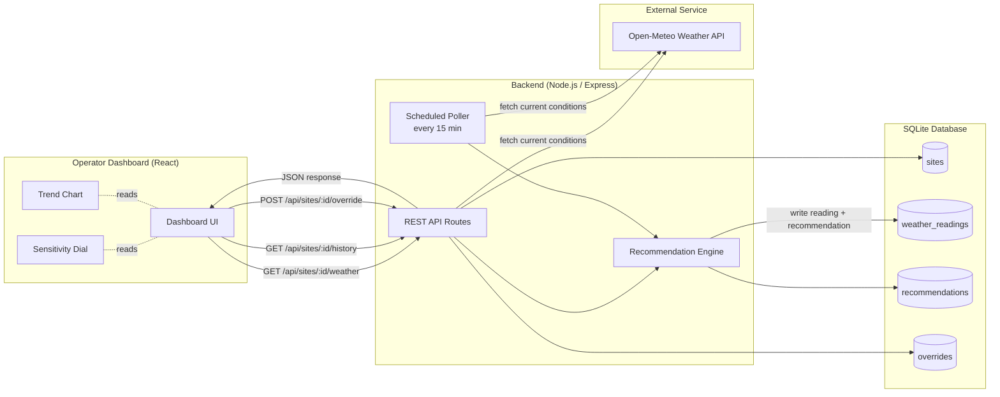

# Architecture

## System overview

## Data flow (single request)

1. Operator opens the dashboard and selects a site.
2. Dashboard requests `GET /api/sites/:id/weather`.
3. Backend calls Open-Meteo for current conditions at that site's lat/lon.
4. `recommendationEngine.js` scores the conditions and returns a sensitivity level (Low/Medium/High), a
   confidence percentage, and a list of plain-language reasons.
5. The reading and recommendation are persisted to SQLite (`weather_readings`, `recommendations`).
6. If an active manual override exists for the site, it takes precedence over the automatic recommendation.
7. The dashboard renders the sensitivity dial, reasoning list, and appends a point to the trend chart.
8. A background cron job repeats steps 3–5 every 15 minutes for every site so history accumulates even when
   no operator has the dashboard open — mirroring how a real production monitoring module would behave.

## Design decisions

- **Rule-based engine over black-box ML for the MVP**: explainability matters more than marginal accuracy gains
  for a security operations tool — an operator needs to trust *why* sensitivity changed. The engine is structured
  so a learned model (e.g. trained on historical false-alarm logs) could later replace or augment the rules
  without changing the API contract.
- **SQLite over a hosted database**: zero setup for judges/reviewers running the project locally; the schema is
  portable to Postgres/MySQL with minimal changes if scaled.
- **Manual override is separate from the recommendation**: operators must always be able to take control from
  the automated system — the API and UI both treat override as an explicit, auditable action (`overrides` table
  keeps `created_at`/`cleared_at`, not a silent overwrite).
